<div align="center">

# Lumen

**Saiba quanto sobra no fim do mês — antes que o mês acabe.**

Controle financeiro pessoal para Android. Gastos avulsos, contas fixas, parcelamentos
e faturas de cartão num lugar só, com os dados guardados **apenas no seu aparelho**.

[**🌐 Ver o site**](https://sasaquee.github.io/lumen/) · [**⬇ Baixar o APK**](https://github.com/Sasaquee/lumen/releases/latest) · [Como instalar](#instalar) · [Privacidade](#privacidade)

<br>

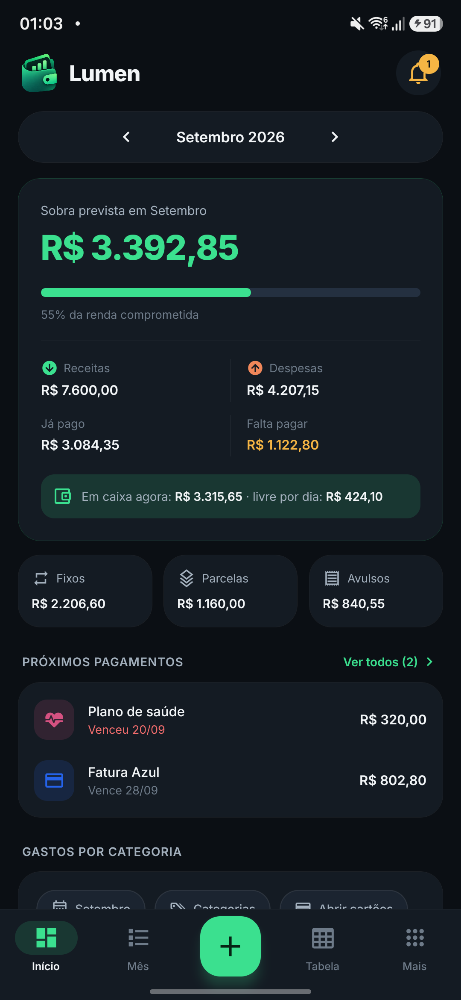
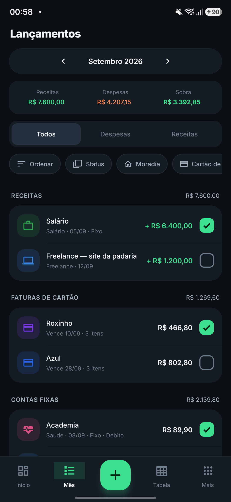
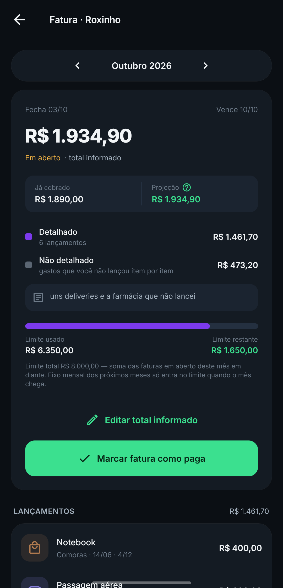
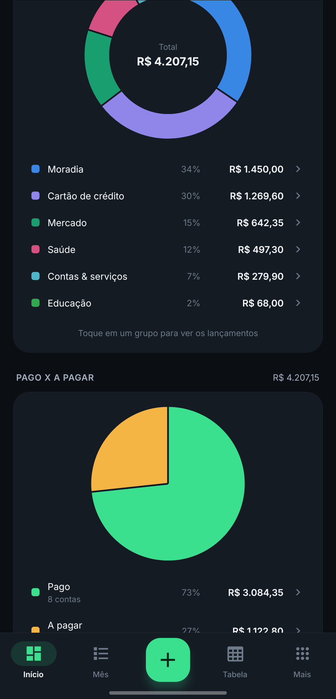

</div>

---

## Por que o Lumen existe

A maioria dos apps de finanças conta o que você **já gastou**. O Lumen foi feito para
responder outra pergunta: *quanto ainda vai sair da minha conta este mês?*

Ele soma o que já aconteceu com o que está contratado — a parcela 4 de 12, o aluguel
do dia 10, a fatura que fecha semana que vem — e mostra a sobra prevista. Sem login,
sem servidor, sem sincronizar nada com ninguém.

---

## O que ele faz

### Um número que resume o mês


A tela inicial abre na **sobra prevista**: receitas menos tudo que ainda vai sair.
Abaixo dela, quanto da renda já está comprometida, o que já foi pago, o que falta
pagar e quanto sobra por dia até o fim do período.

Os três cartões — **Fixos**, **Parcelas** e **Avulsos** — mostram de onde vem o gasto
do mês, e a lista de **próximos pagamentos** avisa o que vence em seguida, com as
contas atrasadas em vermelho.

<br clear="right">

### Lançar em segundos

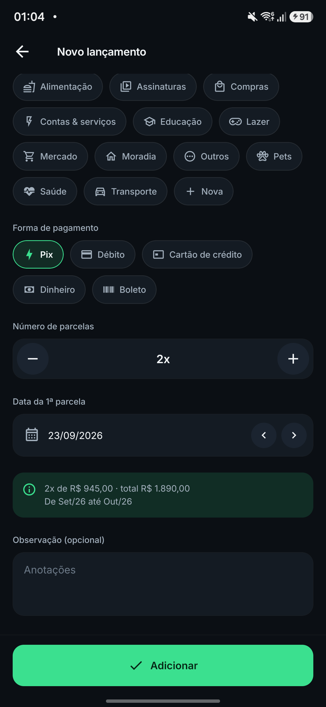

Três tipos, um formulário só:

- **Avulso** — o mercado, o jantar, a farmácia
- **Parcelado** — informe o total **ou** o valor da parcela, e o app converte um no outro
- **Fixo mensal** — repete todo mês sozinho, com data de início e de fim opcional

Antes de salvar, uma prévia mostra exatamente onde a compra vai cair: *"3x de R$ 630,00 ·
total R$ 1.890,00 · de Set/26 até Nov/26"*. No cartão, ela diz em qual fatura a compra
entra e quando essa fatura vence.

<br clear="right">

### Faturas de cartão que batem com a realidade


Cadastre o dia de fechamento e o de vencimento: a compra cai sozinha na fatura certa,
e a parcela de cada mês vai para a fatura daquele mês.

O recurso que resolve o problema real de quem usa cartão: **não lembra tudo que gastou?**
Informe só o **total da fatura** e detalhe o que lembrar. A diferença vira *"gasto não
detalhado"* em vez de sumir da conta — você fica com o valor certo no mês mesmo sem
lançar item por item.

<br clear="right">

### Já cobrado × projeção

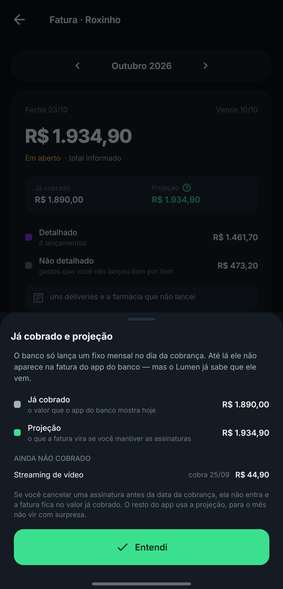

O banco só lança uma assinatura no **dia da cobrança**. Até lá, o app do banco mostra
um valor e o seu planejamento mostra outro.

O Lumen mostra os dois: o que já foi cobrado e a projeção com as assinaturas que ainda
vêm. Um toque no **?** lista o que falta cobrar, com data e valor — é quanto você
economiza se cancelar antes.

<br clear="right">

### Quanto sobrou de limite

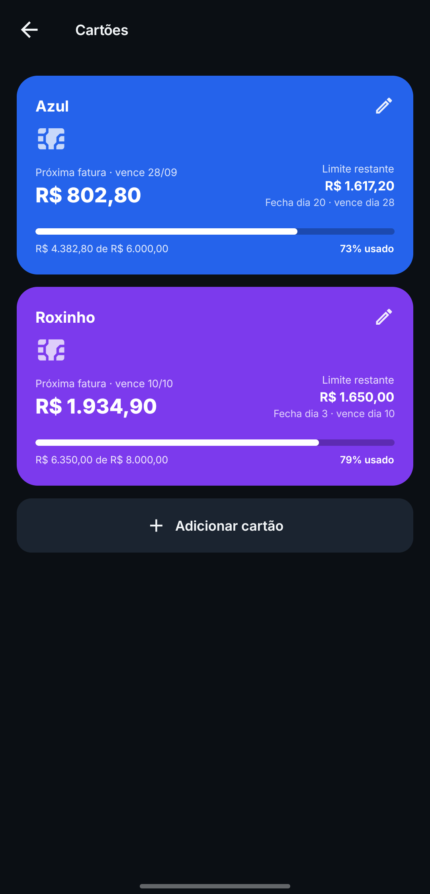

Cada cartão mostra a próxima fatura, o **limite restante** e a porcentagem usada.

O cálculo soma as faturas em aberto deste mês em diante — inclusive as parcelas que
ainda vão cair nos próximos meses. É por isso que o número costuma ser menor (e mais
honesto) que o do app do banco.

<br clear="right">

### O mês inteiro, filtrado do seu jeito


A lista do mês separa receitas, faturas de cartão, contas fixas, parcelas e avulsos.
Dá para filtrar por **grupo de gasto** (os grupos saem das suas próprias categorias),
por **status** (pago ou não pago) e ordenar por valor, vencimento ou número de parcelas.

Marcar como pago é um toque na caixinha.

<br clear="right">

### Para onde o dinheiro foi


Rosca de gastos por categoria com duas visões: tudo que passou no cartão agrupado como
**"Cartão de crédito"**, ou os cartões **abertos**, com cada compra na sua categoria.
Tocar numa fatia abre a lista já filtrada.

Logo abaixo, a pizza de **pago × a pagar** mostra o quanto do mês já foi quitado.

<br clear="right">

### Ver o que vem pela frente

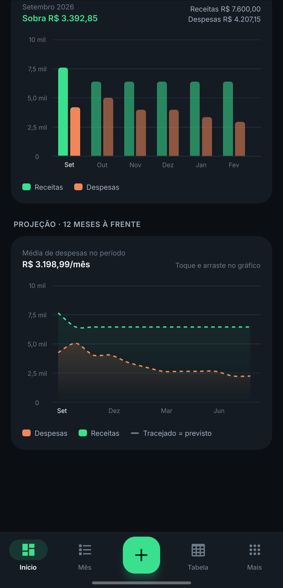

Barras de receitas contra despesas dos próximos meses e uma linha de projeção de até
12 meses à frente, já contando as parcelas que vão vencer e os fixos mensais. O
tracejado é o previsto.

<br clear="right">

### Tabela e avisos

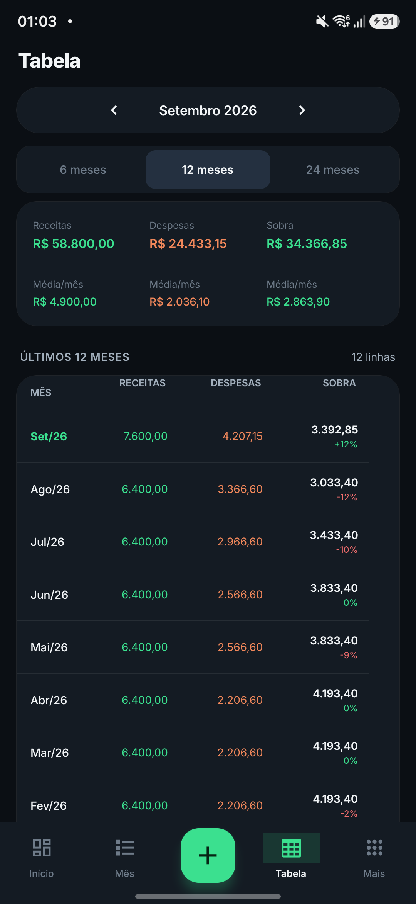
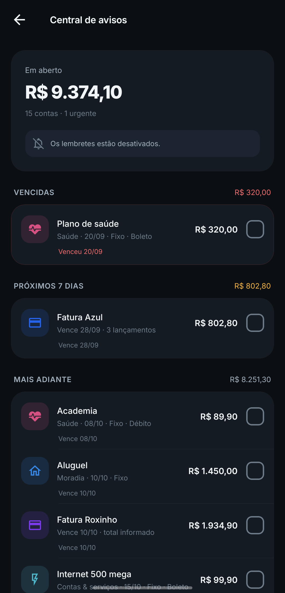
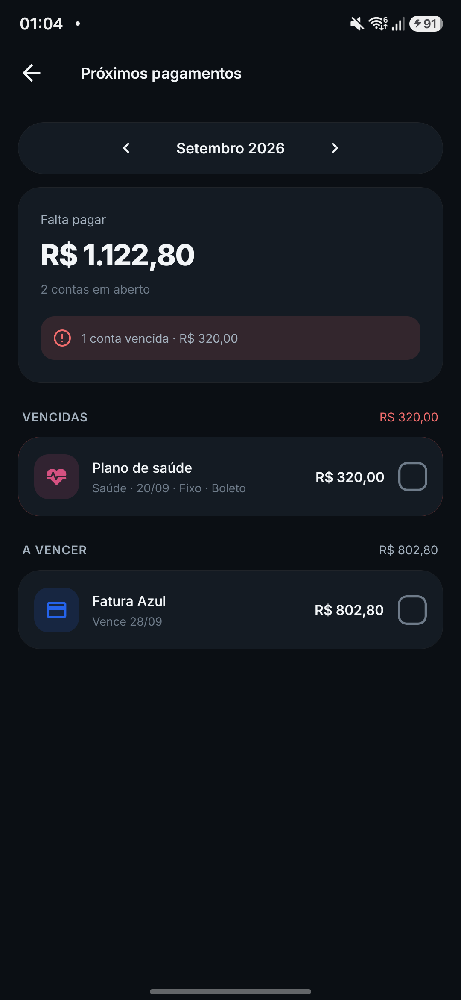

A **tabela** resume 6, 12 ou 24 meses em linhas de receita, despesa e sobra, com a
variação mês a mês.

A **central de avisos** agrupa tudo em aberto por urgência: vencidas, próximos 7 dias
e mais adiante. Os lembretes chegam como notificação 1 dia, 3 dias e 1 semana antes do
vencimento — um aviso curto, com o detalhe dentro do app, para o fim do ciclo não virar
uma enxurrada de notificações.

### Seu mês não precisa começar no dia 1º

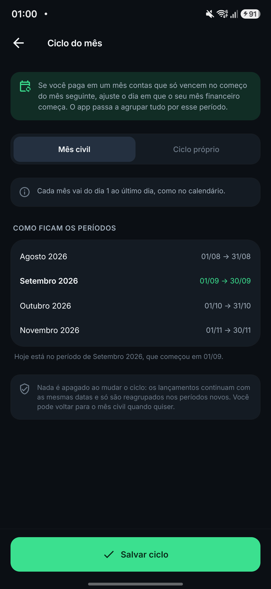

Recebe no dia 5 e paga tudo até o dia 4 do mês seguinte? Configure o **ciclo próprio**
e o app reagrupa os períodos.

Nada é apagado ao mudar: os lançamentos mantêm as datas e só são reagrupados. Dá para
voltar ao mês civil quando quiser.

<br clear="right">

---

## Instalar

1. Baixe o APK na [página de releases](https://github.com/Sasaquee/lumen/releases/latest).
2. O Android vai pedir permissão para instalar de **fontes desconhecidas** — é esperado,
   o app não está na Play Store.
3. O Play Protect pode exibir um aviso, porque o APK é assinado com uma chave de
   desenvolvimento. Toque em *Instalar mesmo assim*.

Requer **Android 7.0 ou superior**.

---

## Privacidade

O Lumen **não tem servidor**. Não há cadastro, login nem conta para criar, e o app não
pede nenhuma permissão de rede para funcionar.

Tudo fica num banco SQLite dentro do aparelho, na área privada do app. Nada é enviado
para lugar nenhum — nem para o autor, nem para terceiros, nem para serviços de análise.

Em **Mais → Exportar backup** você gera um arquivo `.json` e escolhe onde salvar; em
**Apagar todos os dados**, zera tudo. Desinstalar o app também apaga o banco, então
exporte antes se quiser guardar o histórico.

---

## Para desenvolvedores

Expo SDK 57 (React Native 0.86, TypeScript) · expo-sqlite · expo-notifications · react-navigation · react-native-gifted-charts

### Estrutura

```
App.tsx                    navegação (abas + pilha) e carregamento de fontes
src/data/db.ts             schema SQLite, CRUD, backup/restauração
src/data/engine.ts         cálculo dos meses: recorrentes, parcelas, faturas de cartão, totais
src/data/store.tsx         contexto global (ledger + mês selecionado)
src/data/demo.ts           dados fictícios das capturas de tela (só na build de demonstração)
src/components/            UI base, gráficos, linha de lançamento
src/screens/               Início, Mês, Tabela, Mais, formulários, fatura, cartões, categorias, ciclo, planos, próximos pagamentos, central de avisos
src/utils/dates.ts         mês civil e ciclo financeiro (início, fim, a que ciclo uma data pertence)
src/data/filters.ts        grupos de gastos e ordenações da aba Mês
src/data/reminders.ts      avisos e central de avisos (lógica pura, testável)
src/data/notifications.ts  permissão, canal e agendamento no Android
```

### Rodar / gerar APK

```bash
npm install
npx expo prebuild -p android
cd android && ./gradlew assembleRelease
adb install -r app/build/outputs/apk/release/app-release.apk
```

Para desenvolvimento com recarga ao vivo: `npx expo run:android` (build de debug + Metro).

### Build de demonstração

As capturas deste README vêm de uma build à parte, com dados fictícios, que instala ao
lado do app de verdade sem tocar no banco dele:

1. em `app.json`, adicione `"extra": { "demo": true }`;
2. em `android/app/build.gradle`, troque o `applicationId` para `com.lumen.financas.demo`;
3. em `android/app/src/main/res/values/strings.xml`, troque o `app_name` para `Lumen Demo`;
4. gere o APK e instale.

`src/data/demo.ts` popula o banco na primeira abertura — e **só** quando `extra.demo`
está ligado e o banco está vazio. Desfaça os três passos antes de gerar a build normal.

### Regras de negócio

- Valores guardados em centavos.
- **Pago/pendente** fica na tabela `paid` com chaves `e:<entrada>:<parcela>`, `r:<recorrente>:<YYYY-MM>` e `c:<cartão>:<YYYY-MM>` (fatura inteira).
- **Cartão:** compra feita no dia de fechamento ou depois cai na fatura seguinte. Uma fatura é identificada pelo seu mês de **vencimento**, e entra no período em que a data de vencimento cai.
- **Fatura tem dois nomes e o app mostra só um.** Internamente a fatura é identificada pelo mês de vencimento (a "fatura de outubro" do banco), mas na tela ela aparece pelo **ciclo que a paga** — o mesmo nome que o mês tem no resto do app. Com ciclo começando dia 11 e vencimento dia 10, a fatura de outubro aparece como "Setembro". `invoiceMonthOfCycle` faz o caminho de volta do ciclo para a fatura. A data de fechamento e a de vencimento continuam visíveis no topo da tela, para bater com a fatura do banco.
- `entries.invoice_month` **fixa** a compra numa fatura: ao detalhar um total informado, a data da compra continua sendo a real, mas o lançamento pertence àquela fatura mesmo que a data caia em outra. Sem esse campo, vale a regra do fechamento.
- **Limite** (`cardCommitted`) é a soma das faturas em aberto do mês atual em diante — detalhado mais a parte não detalhada. Fixo mensal conta por **mês**, não por dia: "o mês dele" é o mês em que a **fatura é paga** — o mesmo em que o app mostra o lançamento. O fixo da fatura deste mês já ocupa limite mesmo que o dia da cobrança ainda não tenha chegado; o das faturas dos próximos meses só passa a ocupar quando aquele mês vira o atual, com uma exceção de segurança: cobrança que **já aconteceu** sempre conta, porque o dinheiro já saiu do limite de verdade. `cardAvailable` devolve o que resta do limite.
- **Já cobrado × projeção** (`isPendingCharge`, `Invoice.charged` / `Invoice.pending`): o banco só lança um fixo mensal no dia da cobrança, então até lá ele existe no Lumen e não na fatura do app do banco. A tela da fatura mostra os dois números com um "?" que explica a diferença e lista o que ainda não foi cobrado — dá para ver quanto se economiza cancelando a assinatura antes da data. Compra parcelada **não** entra na projeção: o banco já sabe das parcelas futuras desde a compra. `Invoice.total` continua sendo a projeção, que é o que o resto do app usa para planejar o mês.
- Como o total informado vem do app do banco, ele cobre só o que já foi cobrado: o **não detalhado** é `total informado − detalhado já cobrado`, e o fixo mensal pendente entra **por cima** em vez de ser descontado.
- **Total da fatura informado:** em `invoice_totals (card_id, month)` a pessoa grava o valor cheio que veio na fatura. Os lançamentos daquela fatura passam a ser o "detalhado" e a diferença vira gasto **não detalhado** — eles não somam por cima do total. Se o detalhado ultrapassar o total informado, vale a soma dos detalhes (para não subestimar o mês) e a tela avisa. A parte não detalhada aparece nos gráficos como categoria sintética e também ocupa limite do cartão.
- **Vales são carteiras à parte**, não linhas do caixa. Cada um é uma linha em `wallets` (nome, ícone, cor) e os lançamentos apontam para ele por `wallet_id` — dá para ter vale refeição e alimentação juntos, ou dois com o mesmo nome, sem os saldos se misturarem. O método `vr` diz só "saiu de um vale"; qual deles vem no `wallet_id`, igual ao `card_id` do cartão.
- O crédito não entra em `totals.income` e o gasto não entra em `totals.expense`, então a sobra do mês não infla com benefício que só dá para gastar em comida. `walletSummary(vale, ciclo)` devolve o **limite total** (o que sobrou do ciclo anterior mais o crédito que entrou agora) e o **restante**; o não usado passa para o mês seguinte, como no cartão de verdade.
- Gasto no vale **nasce quitado** e fica fora de `openDues`: o dinheiro sai do saldo na hora da compra, não há nada a vencer nem a lembrar.
- **Ciclo financeiro:** `settings.cycle_start_day` define o dia em que o mês financeiro começa (1 = mês civil, o padrão). Com dia 6, "Setembro" vai de 06/09 a 05/10 — útil para contas que vencem no começo do mês seguinte mas são pagas no mês corrente. Ciclos que começam depois do dia 15 levam o nome do mês seguinte (dia 25 → "Setembro" = 25/08 a 24/09). Os ciclos são contíguos e sem sobreposição, então nada é contado duas vezes nem fica de fora. Mudar o ciclo só reagrupa: nenhuma data de lançamento é alterada.
- **Recorrentes:** "alterar valor só deste mês" cria um registro em `recurring_overrides`; "alterar a partir de um mês" encerra o recorrente antigo e cria outro, preservando o histórico. A chave do ajuste é o `chargeMonth` do item: fora do cartão é o próprio ciclo, no cartão é o mês civil da cobrança.
- **Preferências** (`settings`) ficam fora de "apagar todos os dados" e do `wipeAll`, mas entram no backup.
- **Grupos de gastos** (filtros da aba Mês) saem das próprias categorias cadastradas — criar uma categoria já a coloca no filtro — mais o grupo "Cartão de crédito". Um item pertence ao grupo da sua categoria e, se estiver em fatura, também ao do cartão; o filtro é OU entre os grupos marcados.
- A parte não detalhada de uma fatura é exposta por `Ledger.expenseItems` como um item sintético (`source: 'undetailed'`, categoria `-1`) para aparecer em listas, filtros e no gráfico como qualquer despesa. Ele não existe em `MonthData`, então não afeta os totais, que já somam `undetailed` à parte.
- **Gráfico de categorias** tem dois modos (`CardMode`). Em `grouped` (padrão) tudo que passa no cartão vira a fatia sintética "Cartão de crédito" (categoria `-2`) e sai da categoria própria, para nada contar duas vezes. Em `open` o que está detalhado volta para a categoria do lançamento e só o não detalhado fica em Cartão de crédito. Os dois modos somam o mesmo total.
- Cada item carrega `dueDate`: no cartão é o vencimento da fatura, fora dele é a própria data. É por ela que `byCategoryRange` soma períodos no nível do dia, então cada parcela conta uma vez só, no mês em que é paga.
- **Lembretes** são notificações locais agendadas por data, agrupadas por **dia em que o aviso dispara** — não por vencimento. No fim do ciclo várias contas caem juntas e isso viraria uma enxurrada; o aviso é um resumo curto e o detalhe fica na central de avisos, dentro do app (tocar na notificação abre ela). Contas e faturas já pagas não geram aviso, e `syncReminders` reprograma tudo do zero a cada escrita no banco (o `useEffect` do `StoreProvider`), então quitar uma conta apaga o lembrete dela.
- **A aba Mês nunca lista gasto de cartão item a item**: cada fatura aparece como uma linha (`Ledger.invoiceItem`), e o detalhe fica na tela da fatura. Por isso `Ledger.listItems` (o que a lista mostra) é diferente de `Ledger.expenseItems` (tudo, usado nos gráficos).
- O teto de `MAX_SCHEDULED` existe porque o Android limita alarmes pendentes; ficam os vencimentos mais próximos.

